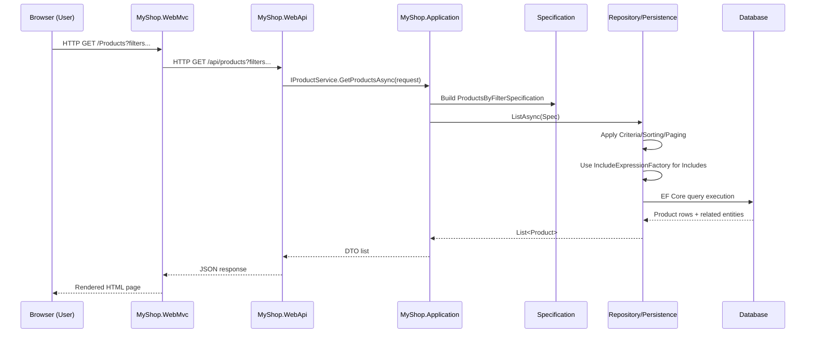

# MyShop

## About

MyShop is a sample e-commerce application built to showcase **Clean Architecture**, the **Specification pattern**, and a **type-safe Include/ThenInclude factory** on top of Entity Framework Core.

The main goals of the project are:

* To demonstrate how to keep **domain logic** independent from infrastructure concerns (EF Core, Web, UI).
* To centralize **query logic** (filtering, sorting, pagination, includes) into reusable **Specifications** instead of scattering `Where`, `OrderBy`, `Include` calls across the codebase.
* To replace fragile, reflection-based Include builders with a **strongly-typed `IncludeExpressionFactory`**, making complex `Include` / `ThenInclude` graphs:

  * discoverable,
  * testable,
  * and compliant with SOLID principles.

Although the domain is a simple online shop (Products, Categories, Orders, etc.), the main focus of MyShop is **architecture and patterns**, not UI design.

---

## Features

* **Clean Architecture**

  * Clear separation of Domain, Application, Persistence, Web API, and MVC layers.
  * Dependency flow from outer layers to inner layers only.

* **Specification Pattern**

  * Encapsulates query logic (filters, sorting, pagination, includes) into reusable specification classes.
  * Application layer depends on `ISpecification<T>` abstractions instead of EF-specific APIs.

* **Type-safe Include Builder**

  * `IncludeExpressionFactory` produces expression trees used by EF Core `Include/ThenInclude`.
  * Eliminates reflection-based string includes.
  * Reduces runtime errors and improves refactor-friendliness.

* **End-to-end Request Flow**

  * ASP.NET Core MVC front-end (`MyShop.WebMvc`) calls the Web API (`MyShop.WebApi`).
  * Web API calls Application services.
  * Application chooses the correct Specification and hands it to Persistence.
  * Persistence executes the Specification via EF Core and returns results.

* **Unit Tests**

  * Tests for the Application layer and Specifications in `tests/MyShop.Application.Tests`.

---

## End-to-end Specification Flow

The typical read flow for something like a **“Get Products with filters and includes”** scenario looks like this:

1. **Browser (User)**

   * Requests a page, e.g. `/Products?categoryId=1&page=2`.

2. **Web MVC (`MyShop.WebMvc`)**

   * Receives the HTTP request.
   * Calls the Web API endpoint, e.g. `GET /api/products?categoryId=1&page=2`.

3. **Web API (`MyShop.WebApi`)**

   * Maps the HTTP query string to an `Application` request/DTO.
   * Calls the appropriate service method, for example:

     * `IProductService.GetProductsAsync(request)`.

4. **Application Layer (`MyShop.Application`)**

   * Builds a **Specification** using the request data:

     * e.g. `new ProductsByFilterSpecification(categoryId, searchText, page, pageSize);`
   * Specification defines:

     * `Criteria` (where clause),
     * Sorting,
     * Pagination,
     * and which navigation properties to include.

5. **IncludeExpressionFactory / Include Builder**

   * The specification either directly uses or internally calls a **factory** such as `IncludeExpressionFactory` to describe which related entities should be included.
   * This factory generates **expression trees** instead of using reflection/strings.

6. **Persistence Layer (`MyShop.Persistence`)**

   * A Repository (e.g. `ProductRepository`) receives the `ISpecification<Product>`.
   * It translates the specification into an EF Core query:

     * applies `Where`,
     * applies `OrderBy`,
     * applies `Skip/Take`,
     * and applies all includes generated by the factory.
   * Executes the query against the database.

7. **Back to Application → Web API → MVC → Browser**

   * Repository returns a list of domain entities (or DTOs).
   * Application layer maps domain entities to DTOs/view models.
   * Web API returns JSON.
   * MVC consumes JSON and renders the HTML page.

### Sequence Diagram (Specification Pipeline)



---

## Getting Started

```bash
# Clone the repository
git clone https://github.com/tbiyiktas/MyShop.git
cd MyShop

# Restore packages and build
dotnet restore
dotnet build

# Run the test suite
dotnet test tests/MyShop.Application.Tests/MyShop.Application.Tests.csproj
```

---

## Project Structure

* `src/MyShop.Domain` – Domain entities, value objects, and core business rules.
* `src/MyShop.Application` – Specifications, application services, DTOs, and interfaces.
* `src/MyShop.Persistence` – EF Core DbContext, repositories, and `IncludeExpressionFactory`.
* `src/MyShop.WebApi` – Minimal API / controllers exposing CRUD & query endpoints.
* `src/MyShop.WebMvc` – MVC front-end that consumes the Web API.
* `tests/MyShop.Application.Tests` – Unit tests for specifications and builders.

---

## Build & Test

```bash
# Build all projects
dotnet build

# Run all tests
dotnet test
```

---

## Roadmap / Ideas

* Add more unit tests for edge cases of the `IncludeExpressionFactory`

  * e.g. null arguments, invalid include graphs, nested child collections.
* Enrich XML documentation for public APIs (Specifications, Services, Repositories).
* Add GitHub Actions workflow to run `dotnet build` and `dotnet test` on every push.
* Consider publishing the Specification + Include factory as a separate **NuGet package**.

---

## Contributing

Contributions, suggestions, and code reviews are welcome.

* Open an issue to discuss significant changes.
* Follow the existing code style.
* Make sure all tests pass before opening a pull request.

---

## License

This project is licensed under the **AGPL-3.0** license.
See the `LICENSE.txt` file for details.
